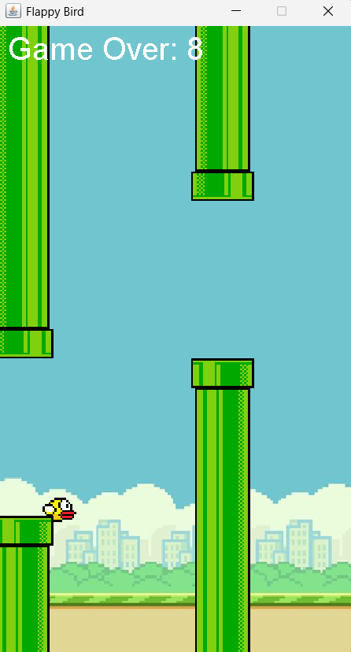
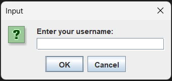
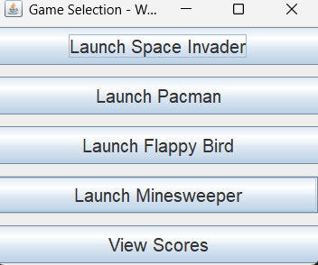
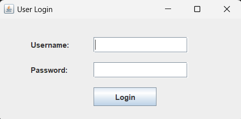
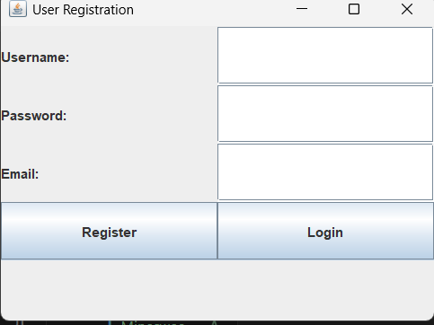
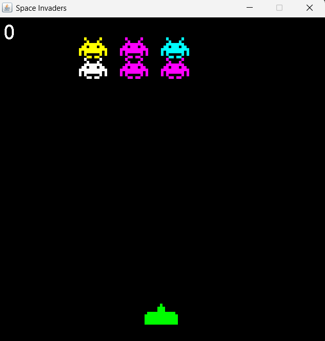
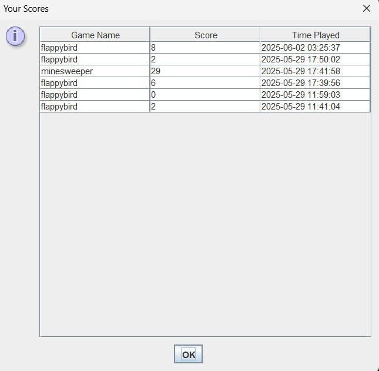

# 🎮 Game Management System (Java Desktop Suite)

The **Game Management System** is a Java desktop app offering multiple classic games with login/registration and a central selection menu. It includes score tracking and a GUI built using Java Swing.

---

## 🕹️ Game Modules

### 🐤 Flappy Bird
Side-scrolling game where you control a bird flying between pipes.



---

### ⌨️ Game Running (Username Prompt)
Prompts for username before launching a game session.



---

### 🎮 Game Selection Hub
Launch any game or view scores from a single interface.



---

### 🔐 Login
Simple login form for existing users.



---

### 💣 Minesweeper
Click tiles and avoid hidden mines.


---

### 📝 Register
Sign-up form for new users.



---

### 👻 Pacman
Collect dots while avoiding ghosts.


---

### 👾 Space Invader
Shoot aliens before they reach you.



---

### 📊 View Scores
Displays past game scores by user.



---

## 🛠️ Technologies Used

- **Language**: Java  
- **UI**: Java Swing  
- **Architecture**: OOP  
- **Data Handling**: File-based (or in-memory)

---

## 🚀 How to Run

```bash
javac -d bin src/**/*.java
java -cp bin ui.GameSelection
